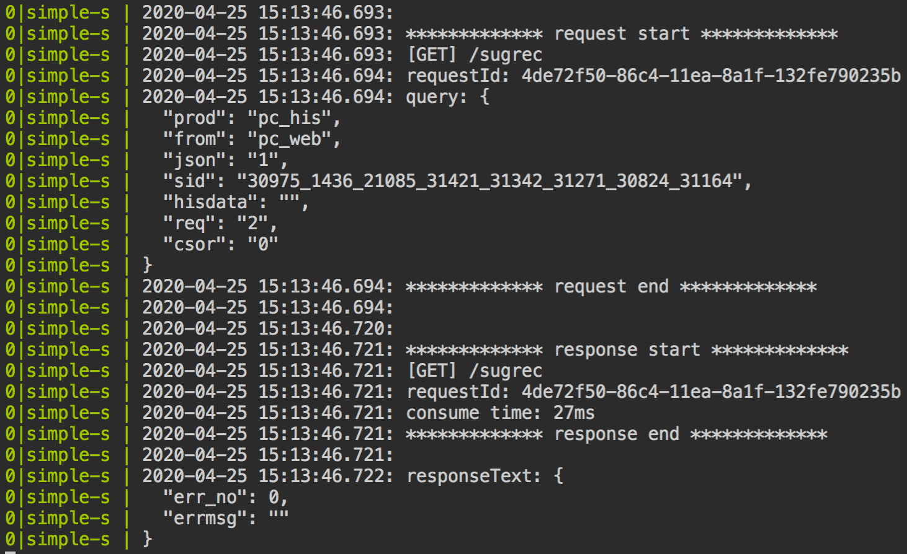
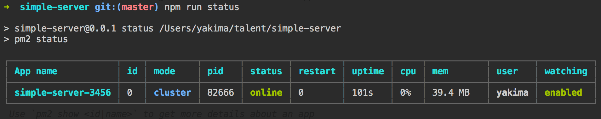

# simple-server

> simple-server是一个使用NodeJS编写的简单服务，支持静态资源、请求转发、数据mock。非常适合在开发、测试环境使用。

simple-server具有如下特点：

1. 集成mock服务（服务端数据模拟），即支持使用静态JSON文件，也支持返回JS动态生成的数据，支持高级拓展（如根据前端上行参数自定义返回不同结果）；
2. 默认支持跨域访问；
3. 支持post传输最大100M的大文件（100M足够一般的开发、测试需求了。请注意，如果使用nginx等其他服务代理时，这些服务本身也有文件大小限制的，没记错的话nginx默认限制1M，tomcat默认限制2M，最终能支持的大小是由所有这些服务中的下限决定的）；
4. 针对请求转发场景进行了日志优化，便于排查问题（由于目标场景是请求量不大的测试或者开发环境，所以日志被格式化便于阅读，若用于生产环境请稍加修改）。
5. 集成了PM2支持，只要几个命令即可做到异常时自启动、配置/mock文件修改时自启动，开机自启动（开启自启不支持window系统），部署运维方便；
6. 可作为静态文件服务器。
7. 支持解析gzip或deflate压缩过的响应内容。

## 截图

输出日志截图：



应用状态截图（使用pm2部署，App名称为`simple-server-${config.port}`，便于知悉当前服务所占用的端口号）：



## 项目部署

***本项目使用`pm2`进行项目的启动与维护。***

1、安装依赖

```bash
npm run installDependencies
```

2、启动项目

***请先将项目根目录的config-example.js文件重命名为config.js文件，然后根据实际需要修改对应配置，然后再进行后续操作（配置项中各参数的说明见后文）***

注：以下命令需在项目根目录下执行，其中部分命令可视为`pm2`对应命令的别名，可以在任意目录下通过直接使用`pm2`命令达成。

```bash
# 初次启动（在项目根目录下执行）
npm run start

# 重启（在项目根目录下执行）
npm run restart
```

3、开启自启动

执行下述命令，pm2会给出一串脚本命令，在终端中复制粘贴该命令并回车执行即可（有时候会直接执行成功然后告诉你执行成功了，这时候就不用再复制命令手动去执行了）。

```bash
# 在项目根目录下执行
npm run getShellUsedToStartProjectAfterReboot
```

4、查看项目日志

```bash
# 在项目根目录下执行
npm run log
```

5、停止和删除项目

停止项目：

```bash
# 在项目根目录下执行
npm run stop
```

从PM2项目清单中删除项目：

```bash
# 在项目根目录下执行
npm run delete
```

## 配置文件规则说明

### 设置服务端口

修改配置文件中的`config.port`字段，默认启用端口号为3456。示例配置如下：

```javascript
const config = {
    // ...
    port: '3456',
    // ...
}
module.exports = config
```

### 请求代理/转发

修改配置文件中的`config.proxyTable`字段即可。示例如下：

```javascript
const config = {
    // ...
    proxyTable: {
        '/apis/proxy-test': {
            target: 'http://test.api.com',
            changeOrigin: true,
            pathRewrite (path, req) {
                return path.replace('/apis/proxy-test', '/apis/proxy')
            },
        },
        '/apis/proxy': {
            target: 'http://production.api.com',
            changeOrigin: true,
        },
    },
    // ...
}
module.exports = config
```

如上配置对应的解释描述如下：

- 发至本服务的路径以`/apis/proxy-test`开头的请求会被转发到`http://test.api.com/apis/proxy`下。例如，发至本服务的`/apis/proxy-test/v2/queryDate.do`请求会被转发到`http://test.api.com/apis/proxy/v2/queryDate.do`。

- 这里采用“越具体的配置，优先级越高”的规则，即如果某个请求符合多条规则，其中最具体的规则会生效。如，若同时配置了针对`/apis/proxy`和`/apis/proxy/v2`的转发规则，则`/apis/proxy/v2/test.do`请求会依据`/apis/proxy/v2`的规则被转发，其他如`/apis/proxy/v1/test.do`的请求则会依据`/apis/proxy`的规则被转发。

说明：程序会自动对代理请求返回的结果进行备份，备份目录为/data/mock/proxy，生成的文件名是根据请求地址自动生成的。大部分时候不需要搭理这些备份文件。但是如果你正好也同时使用用本服务做mock服务，则可以拷贝这些文件作为mock数据文件，具体用法见后文描述。

本项目针对请求代理/转发的场景，针对性的进行了日志输出的优化，可以通过修改`config.logLevel`的值来切换不同的日志打印丰富度，目前支持以下两个枚举值：

1. `simple`：仅打印核心内容，日志量少，有可能缺少排查问题的关键信息。
2. `normal`: 打印内容丰富，排查问题时信息更丰富，但相对的，日志量会大很多。

### 返回JSON静态数据

修改配置文件中的`config.jsonTable`字段即可。示例配置如下：

```javascript
const config = {
    // ...
    jsonTable: [
        '/manage2/intention/list',
        '/manage2/carInsurance/queryDetails',
        '/manage2/carInsurance/updateQuotation',
        '/manage2/order/list',
        '/manage2/order/queryDetails',
        '/manage2/order/updateSalesman',
        '/manage2/order/update'
    ],
    // ...
}
module.exports = config
```

如上配置对应的解释描述如下：

若有发至本服务的路径精确匹配`/manage2/intention/list`的请求，则服务器会将文件`/data/mock/json/manage2-intention-list.json`的内容予以返回。

注意：你可以在启动服务器之前，先在`/data/mock/json`目录下手动建立对应的json文件，并填充数据；如果您未提前手动建立对应json文件，程序会自动帮你新建一个内容为`{}`的json文件，内容还需您自行填充。一般来说用后面这种方法会比较方便，修改了文件后程序会自动重启的，不需要手动重启服务。

***小技巧：可以将程序在`/data/mock/proxy`目录下生成的备份文件拷贝至此处使用。***

### 返回JS自定义数据

修改配置文件中的config.customTable即可。示例配置如下：

```javascript
const config = {
    // ...
    customTable: [
        '/great/what'
    ],
    // ...
}
module.exports = config
```

如上配置对应的解释描述如下：

若有发至本服务的路径精确匹配`/great/what`的请求，服务器会将`/data/mock/custom/great-what.js`文件中***导出的函数***予以调用，并将***函数调用后的返回值***发送至前端。

注意：你可以在启动服务器之前，先在`/data/mock/custom`目录下手动建立对应的js文件，在该js文件中通过`module.exports`导出一个函数，该函数需要返回一个json数据（也可以让程序自动创建该文件，程序自动创建的文件会默认写入`module.exports = (req) => { return {} }`来作为占位内容），该函数可接收一个表示请求的`req`参数，所以你可以根据req来判断请求方式、请求头、接口上行参数等来进行返回内容的高级自定义。

说明：之所以在自定义js文件中导出函数而非直接导出数据，是为了便于服务器返回动态内容。

说明：安装程序依赖时默认安装了[mockjs模块](http://mockjs.com/)，你可以在代码中require该模块来生成一些动态mock数据，如下图所示。

```javascript
const Mock = require('mockjs')

const returnRes = (req) => Mock.mock({
    // 属性 list 的值是一个数组，其中含有 1 到 10 个元素
    'list|1-10': [{
        // 属性 id 是一个自增数，起始值为 1，每次增 1
        'id|+1': 1
    }],
    // 在接口里返回请求方式
    method: req.method,
    // 在接口里返回前端传参
    params: (() => {
        if (req.method === 'POST') {
            return req.body
        } else if (req.method === 'GET') {
            return req.query
        }
        return 'Neither post nor get request'
    })(),
})

module.exports = returnRes
```

### 设置静态文件服务

将您的前端文件或其他静态文件放置于`/public`目录下，然后修改配置文件中的`config.public`，该值将与`/public`目录直接映射。config.public的默认值为"/test"，即"/test/index.html"将会访问public目录下的index.html文件。示例配置如下：

```javascript
const config = {
    // ...
    public: '/static',
    // ...
}
module.exports = config
```

如上配置对应的解释描述如下：

假设我们在`/public`目录下存放了`index.html`、`css/style.css`、`scripts/app.js`等文件。那么发至本服务的路径精确匹配`/static/index.html`的请求，将访问`/public/index.html`文件。

说明：

- 在上述配置下，请求`/static`和请求`/static/index.html`实际访问的是同一个文件，因为程序设定的默认首页为`index.html`。

### 重定向

可通过修改配置文件中的`config.redirect`字段设置重定向规则。示例如下：

```javascript
const config = {
    // ...
    redirect: {
        movedPermanently: { // 301 redirect 永久重定向
            '/a': '/b',
        },
        movedTemporarily: { // 302 redirect 临时重定向
            '/vendor/assets/zepto.min.js': 'http://localhost:3000/vendor/assets/zepto.min.js?v=20191122',
        },
    },
    // ...
}
module.exports = config
```

如上配置对应的解释描述如下：

在上述配置规则下，发至本服务的路径精确匹配`/a`的请求将被301永久重定向到`/b`请求；发至本附的路径精确匹配`/vendor/assets/zepto.min.js`的请求将被302临时重定向到`http://localhost:3000/vendor/assets/zepto.min.js?v=20191122`。

### 在线访问项目说明文档

启动本服务后，可通过访问`/help`来访问项目说明文档。

## License/许可

MIT协议。免费开源，可以随意使用，但因使用而产生的问题请自行负责。
